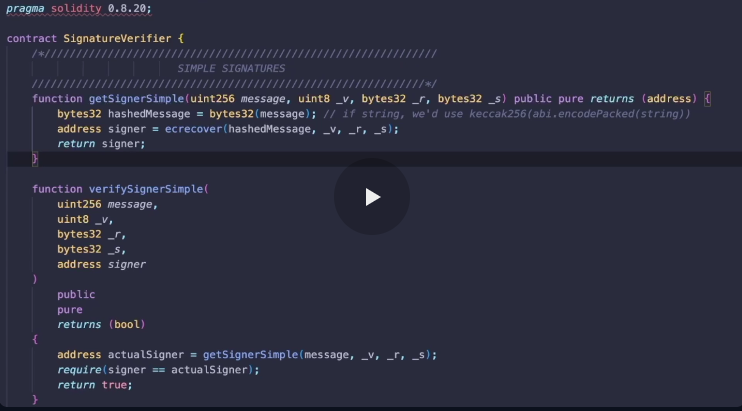
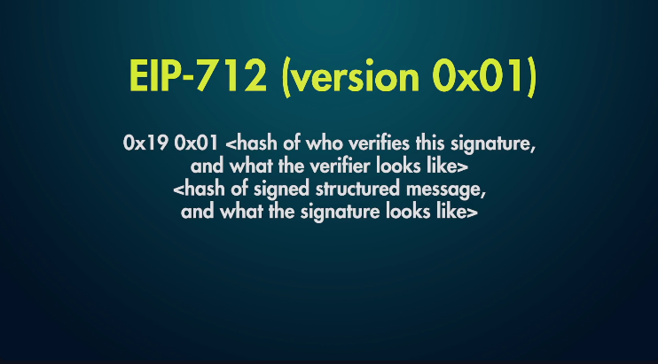
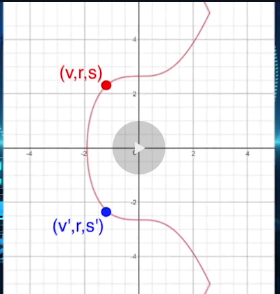
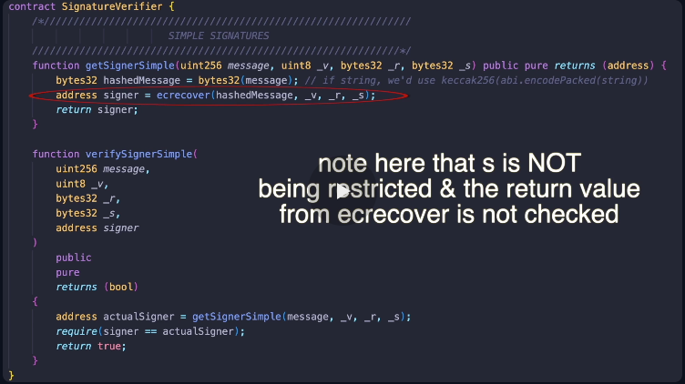

Merkle-Airdrop

what is a merkle tree?
=> Merkle tree(also known as hash tree) is type of data stucture used to efficiently verify the integrity and inclusion of data within a large dataset.

=> it is a binanry tree where every leaf node is a cryptographic hash of a data block, and every non-leaf node is the hash of two of its children nodes. 
example:
```
        a
    b          c
d       e  f       g
```

if the above is a binary tree then, "d","e","f","g" are the leaf node and "a" is the root node, then "d","e","f","g" are the cryptographic hash of a datablock and b = hash(d,e), similarly c = hash(f,g) and a = hash(b,c).

merkle proof: A Merkle Proof is the minimal set of hashes needed to compute the path from a leaf node up to the Merkle Root.

=> A Merkle Proof is the specific list of sibling hashes required to reconstruct the Merkle Root from a specific leaf node. By re-calculating the root using this path, a verifier can mathematically prove the leaf belongs to the dataset without having access to the entire tree.

but why?

EIP-191 and EIP-712

=> EIP-191 standardises what a signed data should look like
=> EIP-721 standardises the format of version specific data and the data to sign

=> EIP-721 is key to prevent replay attacks


sponsered transaction.




what are v, r, s, signature components?

ECDSA - Elliptic Curve Digital Signature Algorithm and it is based on eleptic curve cryptography

it is used to 
    Generate Key pairs
    Create Signatures
    Verify Signatures

brief on what are signatures?
=> Blockchain Signatures provide authentication in blockchain technology
=> Verify that the message (or transactions) originates from the intended sender

ECDSA used in Ethereum is Secp256k1 curve, it wac choosen because of its interoprerability with bitcoin, its efficiency and security,

each point on the curve is our v,r and s


some constants associated with Secp256k1 
-> Generator Point G:
    constant (random) point on the curve
-> Order n:
    Order of the subgroup of eleptic curve points
    Prime number generated using G
    Defines the length of the private key

ECDSA signatures contain three integers and those are V, R, S

r: x point on the secp256k1 curve
    based on some random point capital R
s: Proof signer knows the private key
    calculated using a random constant `k`
    k ensures that the signaure is unique everytime 
v: if in positive or negative part of the curve
    used to recover the public key from r?
    represents index of the point(v,r,s) on the eleptic curve
    whether the point is in +ve y or -ve y, this is known as polarity

How are public keys and private keys generated?

=> Private keys are generated as random integer between 0 and n-1, where `n` is the order
=> Public key a eleptic curve point
    pubKey = p*G
    where p = the private key and * denotes mmodular multiplication! 

How do we know ECDSA private keys are secure?
=> this is because of the Elliptic curve discrete logarithm problem
it is impossible to calculate p from pubKey = p*G

how are signatures created?
=> combined using hash of the message and the private key, this is done using ecdsa
-> firstly using the sha256 hashing algorithm, we hash the message the we generate a securely random number k, which is the nonce
then we generate a Random number `R`
R = k*G
R = (x,y)
then r = x mod n

how is a ecdsa signature verified?
=> it takes the signed message, the signature from the signing algorithm and the public key and outputs a boolean representing whether the signature is valid or not, whether the recovered signer matches the provided public key.
=> This works in reverse of the signing algorithm 

=> we convert the S coordinate back to the R coordinate and verify that the provided r coordinate matches the calcualted r coordinate
-> It is done using the following fomula
S1 = S^-1 (mod n)
R' = (h * s1) * G = (r * s1) * pubKey
R' = (x,y)
r' = x mod n
r' == r?

The EVM precompile EC recover does htis for us in smartcontracts


